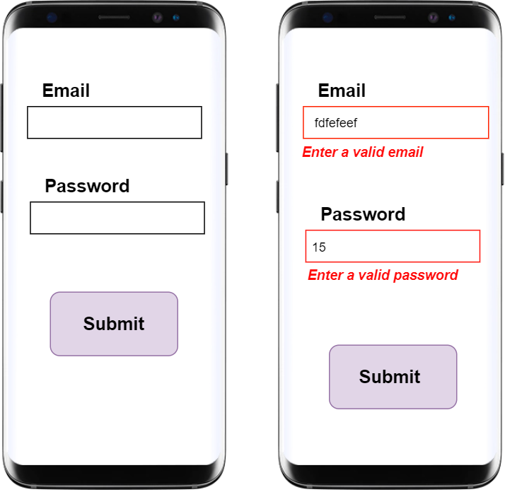

# Login Stateful

`Flutter App`

#### Forms and Validation with Flutter

## App Prototype

 
 
<h2> App Widget Tree </h2>

.

.

.

Validation Process

## PREVIEW APP 

* you can find a video with high quality in this pass https://github.com/HossamMuhammedOmar/login_stateful/blob/main/lib/src/Images/AppPreview.mp4
